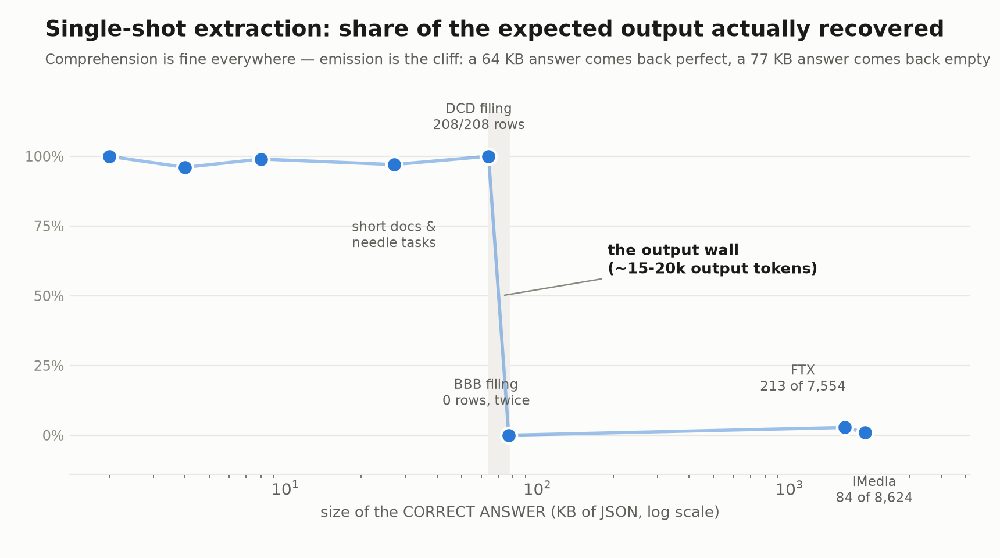
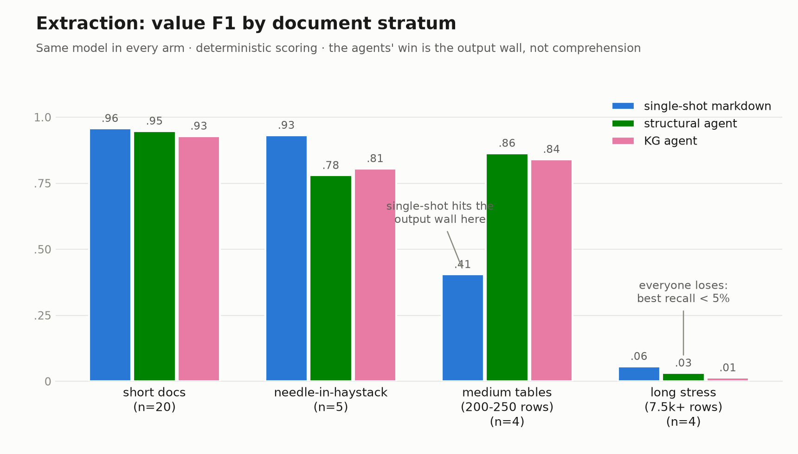
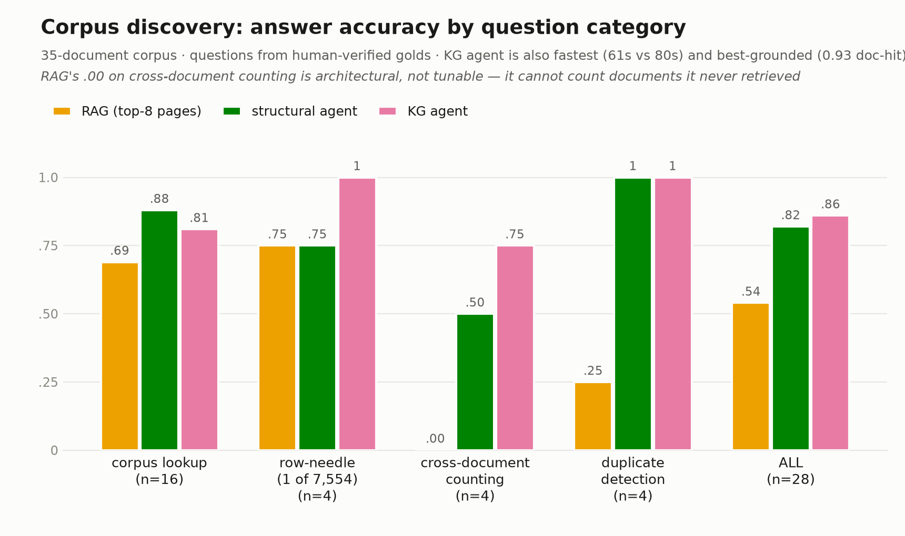

# We Benchmarked Our Own Knowledge Graph Against "Just Paste It Into an LLM". It Lost Half the Time.

*Two controlled benchmarks, 217 runs, no LLM judges. An honest map of where the fancy machinery earns its keep, and where the dumb baseline is simply correct.*

Let's start with a confession.

At [FluidZero](https://www.fluidzero.ai/), we spent months building a knowledge graph pipeline for documents. Parse every PDF into a structural graph of pages, sections, tables and bounding boxes. Run an ontology-constrained extraction pass so every entity, every relation, every mention lands in a typed graph, grounded to the exact region of the exact page it came from. Then put an agent on top that navigates all of it.

It's a lot of machinery. And the whole time we were building it, there was a voice in the back of the room asking the question every over-engineered system deserves:

*"Couldn't you just parse the PDF to markdown and paste it into the LLM?"*

Most teams answer that question with vibes. We decided to answer it with a benchmark. Actually, two.

## The rules: no judges, no mercy

We took 35 real documents (bankruptcy filings, price lists, spec sheets, purchase orders, earnings decks) from a public benchmark, [ExtractBench](https://huggingface.co/datasets/llamaindex/ExtractBench), which ships something precious: **human-verified correct answers** for every document, down to the page where each fact lives.

That let us set two rules we refused to break:

1. **No LLM judges.** Every score in this post comes from deterministic comparison: string matching, numeric tolerance, table row alignment. Run the scorer twice, get identical numbers. No "GPT thought the answer looked right."
2. **Same model everywhere.** Every system under test runs the same Claude model. When one wins, it's the *architecture* winning, never the model.

Then we lined up the contenders. For extraction (turn a PDF and a schema into filled JSON): single-shot markdown, an agent over the structural graph, and the full knowledge graph agent. For corpus Q&A: top-k RAG, the structural agent, and the KG agent with entity resolution on and off.

## First, let me show you the wall

Meet the FTX bankruptcy case. Among its filings is a *Consolidated List of Creditors*: 114 pages of names and addresses, wall to wall.

The correct answer for extracting that one document is a table. Let's size it. Slowly. Painfully.

**7,554 rows**, each with ~10 fields:

```
7,554 rows ≈ 1.66 MB of JSON ≈ 400,000 tokens
```

Now, how much structured output can a model reliably *emit* in one response?

```
~15,000–20,000 tokens. On a good day.
```

That's not a 2× gap. That's a **20× gap**, and it's not fixable with a better prompt, because it isn't a comprehension problem. The model *understands* the creditor list fine. It physically cannot type it out. We call this the **output wall**, and once you see it, you see it everywhere.

We even found the wall's exact address. One court filing with a 208-row answer (64 KB of JSON) came back **complete and perfect** from a single model call. A nearly identical filing with a 250-row answer (77 KB)? The model returned **nothing parseable. Twice.** The cliff between "works perfectly" and "silently returns garbage" is about thirteen kilobytes wide.

In practice, that's the difference between "paste the invoice into ChatGPT works great" and "the loan-tape spreadsheet came back blank and nobody noticed."



## Extraction, round one: the baseline humbles us

On small documents (2-page price lists, spec sheets, purchase orders), here's the score (unified value F1, higher is better):

| | single-shot markdown | structural agent | KG agent |
|---|---|---|---|
| short docs (n=20) | **0.958** | 0.948 | 0.929 |

A tie. On easy documents, one model call over parsed text matches everything we built, in a fraction of the time. We ran a needle-in-a-haystack addendum, finding scattered facts in decks of 20 to 40 pages, and it got worse: single-shot **won outright** (0.932 vs roughly 0.80). When the document fits in the context window, attention is global; every fact is one attention hop away. An agent navigating page by page is just adding steps that can go wrong. And they did.

If we'd stopped here, the conclusion would have been brutal: months of graph engineering, matched by a for-loop and a prompt.

We did not stop here.

## Extraction, round two: the wall gets its revenge

Then come the realistic tables: filings of 17 to 27 pages whose answers run 200 to 250 rows.

| | single-shot markdown | structural agent | KG agent |
|---|---|---|---|
| medium legal docs (n=4) | 0.405 | **0.864** | 0.841 |

Single-shot doesn't lose gracefully here. It hits the output wall and returns fragments or nothing. The agents recovered **100% of table rows on every one of these documents**, including the deliberately corrupted, rotated-scan copies, because they never try to emit 20,000 tokens at once. They walk the table and report ~20 rows per tool call, and *our code* assembles the answer outside the model. The memory lives in the harness, not the context window.

But notice which agent won. The *structural* one. The knowledge graph itself, the semantic layer with its entities and typed relations, added **nothing** to extraction. Anywhere. On the FTX monster it was actually worst of all, and here's the irony that kept us honest: at ingest time, our pipeline had *already extracted all 3,379 creditors from that document into the graph*. The answer was sitting in Neo4j. The extraction agent recovered 99 rows of it, because we never built it a bulk export tool. The data was there. The door wasn't.



So: is the knowledge graph just expensive decoration?

## Round three: ask a different question

Extraction is *transcription*: copy every cell, faithfully. But that's not why anyone builds a knowledge graph. You build it for the moment someone stands in front of 35 documents and asks a question that lives in none of them individually.

So we built a second benchmark: 28 questions over the whole corpus. We didn't write them ourselves, because benchmark authors quizzing their own system tend to ask it things it's good at. Instead, a generator derives every question from the same human-verified answer keys: take a verified fact and ask for it without naming the document; take one row out of a 7,554-row table and ask for one of its cells; aggregate verified values across filings to make counting questions; use the corrupted twin copies for duplicate detection. Questions refer to documents by content ("the Celsius filing", "the pump spec sheet"), never by filename, so *finding the right document* is part of the task. We reviewed the generated set by hand before running anything, and threw out a pair of questions whose phrasing tested the annotators' interpretation rather than what the documents actually say.

We also invited the industry default for this problem to compete: top-k RAG. Embed the pages, retrieve the best eight, answer from those.

| answer accuracy | RAG | structural agent | KG agent |
|---|---|---|---|
| corpus lookup (n=16) | 0.69 | **0.88** | 0.81–0.88 |
| needle: 1 row among 7,554 (n=4) | 0.75 | 0.75 | **1.00** |
| cross-document counting (n=4) | **0.00** | 0.50 | **0.75** |
| duplicate detection (n=4) | 0.25 | **1.00** | **1.00** |
| **overall** | 0.54 | 0.82 | **0.86** |
| cites the right document | 0.71 | 0.79 | **0.93** |
| median speed | **13s** | 80s | **61s** |



Read the RAG column again. **Zero** on cross-document counting. Not a "needs tuning" zero. An *architectural* zero. "How many filings name FTX as the debtor?" is a property of the whole set. No individual chunk contains it, so no similarity search can retrieve it. You cannot count documents you never fetched. RAG answered a question about 35 documents while looking at 8, with predictable results.

And the knowledge graph? Best accuracy. Best citations. Perfect on the needle. Asked for one creditor's details out of 7,554, `link_entities("CHECKR.COM")` went straight to the grounded mention on page 20 with the verbatim quote attached, while RAG shrugged: *"not found in the retrieved pages."* And here's my favorite number in the whole study: the KG agent was **faster** than the same agent without the graph. An entity index replaces page walking. The fancy machinery was simultaneously more accurate, better grounded, and quicker. On this terrain, there was no trade-off to agonize over.

Same graph. Losing transcription, winning location. That's not a contradiction. That's the finding. A knowledge graph doesn't store verbatim table cells; it stores *where things are and how they connect*. Ask it to photocopy a document and it adds hops. Ask it to *find* something and it is the index everything else wishes it had.

## The part nobody's baseline can fake

One more column deserves its own paragraph: citations.

Only the agentic pipeline could ever say *"this number came from page 20; here's the quote, here's the box."* Every markdown and RAG baseline scored approximately **zero** on verifiable provenance, at every accuracy level, in both benchmarks. And this isn't a formatting gap. Provenance is a *verification loop*: you need source coordinates that survived parsing, a contract that forces every claim to carry its source, and a tool that re-reads the cited page to check the quote is really there, all *before* answering. Single-shot can't re-read anything; its generation is already over. You can prompt it to print page numbers, sure. You'll get numbers. They'll be exactly as hallucinated as anything else it prints.

If what you're selling is *trustworthy* answers (audit, legal, compliance, diligence), the cheap baselines don't lose on this axis. They never entered.

## What we actually learned

What we walked away with is a routing table instead of an argument:

- **Small output, single fact?** Paste it into the LLM. Genuinely. It wins or ties, and any architecture that routes an invoice through an agent loop is wasting everyone's time.
- **Output bigger than ~15k tokens?** Only agentic chunked extraction survives the wall. Nothing else works.
- **Thousand-row tables?** Nothing LLM-shaped works. That's a deterministic export job wearing an AI costume.
- **Questions across a corpus? Needles in huge tables? "Show me where this came from"?** The knowledge graph: more accurate, better grounded, and faster than the same agent without it. And RAG, the default answer, is structurally blind to half of these questions.

The graph didn't need to win everywhere. It needed to know where it wins, and now it does, with numbers instead of vibes attached.

The open edges are real and named: entity resolution never got tested on a corpus with genuinely messy naming, page-level citation scoring needs work, one model, modest n. But the continents are drawn. Full methodology, prompts, per-run artifacts, and all 217 runs are in the [whitepaper](./WHITEPAPER.md) if you want to check our math.

We'd suggest you do. That's rather the point.
