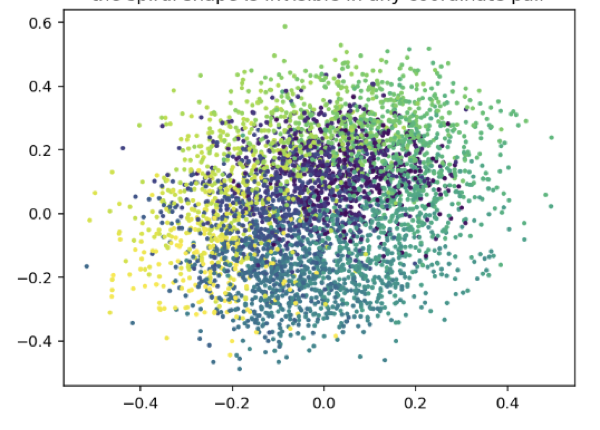
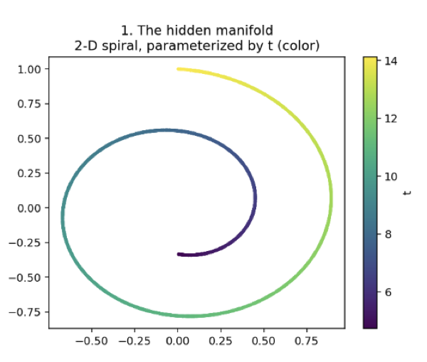
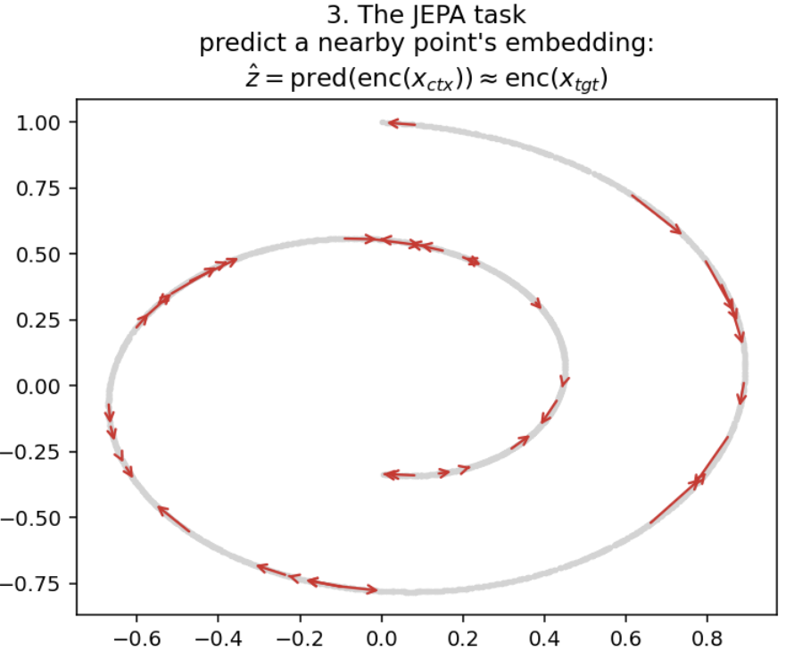
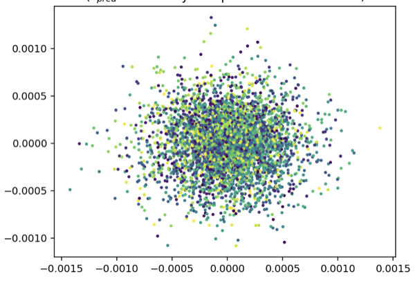
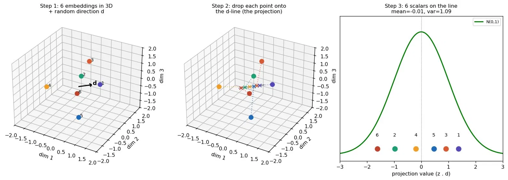
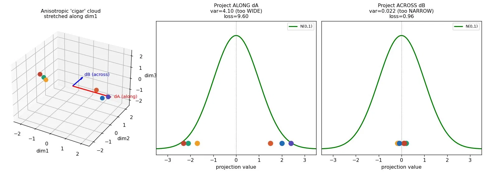
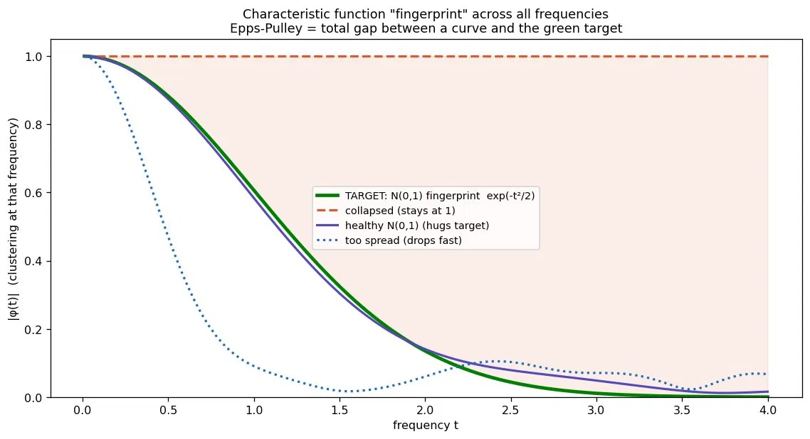
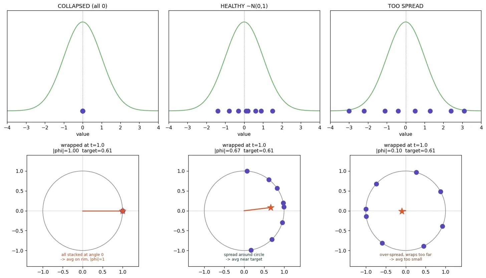

# If You Don't Tell Me What It Is, I'll Figure It Out Myself: A Toy JEPA (Joint Embedding Predictive Architecture)

This is an attempt to break down the concepts of Joint Embedding Predictive Architecture (JEPA) and see it work for a toy example.

For a decade, machine learning has mostly been an elaborate game of copying homework. Tag a million dogs, box a million pedestrians, and the 
model learns to mimic those judgments. It works, but the model only knows what some underpaid annotator was told to point at.

Watch a stranger reach for a coffee cup and you already know, before they touch it, roughly how their hand will close. 
No one labeled "cup-grasping" for you. You learned it by watching the world and quietly predicting what comes next. 
Self-supervised learning is the bet that machines can do the same: drown them in raw data and let them learn the structure by predicting 
one piece of the world from another.

### First, look at this

Let's run a magic trick together.

Behind every point in the dataset we'll use, there's one hidden number we're trying to recover. 
We'll show that the straightforward way to recover it fails completely, no straight-line readout can pull it out, no matter how you 
slice the data. Then we'll train a model that's never told the number exists, and afterward that same simple 
readout recovers it almost perfectly. The model didn't get the answer. It rearranged the data so the answer became reachable.

## What we're actually after: a good representation

Before a model can predict anything useful, it needs a good way to see the data. Raw input is almost always a mess: a 50-dimensional vector, a million pixels, a sensor dump. 
Buried in that mess is the stuff that actually matters, and tangled all around it is stuff that doesn't. A representation is the model's internal 
re-encoding of the input into something cleaner, where the meaningful structure is laid bare and the noise is dropped. 

Get the representation right and everything downstream (classifying, predicting, planning) becomes easy.
So the whole game is: can a model learn a good representation on its own, with no one labeling what "good" means? 
To test it, we need a dataset where we secretly know the right answer, so we can check whether the model found it.

## The dataset: a spiral in disguise

Meet the Swiss roll. It's a 2D spiral, and every point on it is controlled by a single hidden number t. Small t, you're at the inner tip; crank it up, you spiral outward.

Here's the secret the dataset is built from: a spiral. Every point sits somewhere along this one curve, and its position 
is set by a single number we'll call t. Slide t and you travel along the spiral, from the inner tip outward. That one number is the 
entire truth of this dataset. Recover t and you've understood it completely.
(The color is just t painted on so we can see the order, not a category, the same continuous dial, shown as a gradient.)

But the model never sees that clean spiral. It sees this. We rotate the spiral up into fifty dimensions and add noise, and what was a graceful 
curve becomes a shapeless smear. Now, here's the honest part, this lift is reversible. A purely linear method like PCA could rotate it back to 
the spiral, so "fifty dimensions" isn't where the real difficulty hides.
The difficulty is t itself. Even on the clean spiral, t winds around the curve: two points can sit inches apart yet be at opposite ends of the dial. 
No straight cut can read a quantity that spirals. That's the wall we're up against.

## Setup: "You're on your own! Not quite, you've got a neighbour"

Here's where it gets strange, and a little beautiful.

We never tell the model about t. We never tell it about the spiral. We give it exactly one job, and on its face the job looks almost too dumb to matter: 
pick a point, pick a neighbor sitting close to it on the curve, and make each one's embedding predict the other's. 
That's the whole task. Guess what's next to you.

Think about what that quietly demands. The model has no answer key, nothing to copy, no notion of right or wrong handed down from outside. 
The only pressure on it is consistency: whatever summary it invents for a point, that summary has to be enough to predict its neighbor's summary, 
and vice versa. 

It's two strangers told to describe the same street corner from different sides, with no way to talk to each other, and somehow 
their descriptions have to match. The only way they ever agree is if both of them stop inventing and start anchoring on what's actually there, 
the real shape of the corner they're both standing on.

That's the trick in miniature. There's no teacher in this room. The "supervision" isn't a label, it's a demand for agreement, and the only thing 
in the universe that lets neighbors reliably agree is the genuine structure of the data they're sitting on. Lean on that structure and your predictions 
line up. Ignore it and they don't. So the model, chasing nothing but consistency with its neighbors, gets quietly dragged toward the one representation 
that actually reflects how the data is built.

These red arrows are that entire signal, every one is a "predict the neighbor" pair, and there is nothing else. 
No t, no labels, no hints. Just the insistence that points close in the world stay close in the model's mind.

Quite simple, isn't it? But, but, but... there's a catch: there's a way to cheat at "make neighbors agree" that requires understanding nothing at all.

Imagine two people A and B, told to describe a complicated scene and forced to match each other word for word. They could actually try, 
painstakingly agreeing on every curve and shadow and risking a mismatch at each step. Or they could cheat: both just say "it's a thing," 
every single time, for every scene they're ever shown. Perfect agreement, zero mistakes, nothing learned. The rule said agree, and the 
laziest way to always agree is to make every answer identical and empty.

And that's exactly the loophole. A and B found a way to win the game completely — perfect agreement, zero mistakes — while learning absolutely 
nothing about what they're looking at. The rule said "agree," and the cheapest way to always agree is to make every answer identical and empty.

A model handed the same task finds this shortcut almost instantly, and with none of the hesitation. Watch what it does.

### The cheat, made real

This is what "it's a thing" looks like when a model does it.

Every one of the 4,096 points has been crushed into a single tiny blob. Look at the axis scale: the entire cloud spans about one thousandth of a unit. 
The model took every input, the inner tip of the spiral, the outer edge, everything, and mapped them all to essentially the same point in embedding space.

And by the rules we set, this is a flawless solution. The task was "make a point's embedding predict its neighbor's." 
If every embedding is the same vector, then every prediction is trivially correct, the neighbor's embedding is right there, 
identical to yours. The prediction error drops to zero. The model has technically won.

It has also learned nothing. The color, which is the true position t, is splattered randomly across the blob with no order at all. 
Inner-spiral points and outer-spiral points sit on top of each other, indistinguishable. The model satisfied every constraint we gave it 
and threw away every bit of structure in the process. This is representation collapse, and notice it isn't a bug in the code or a bad 
hyperparameter, it's the optimizer doing its job too well, finding the cheapest possible way to make the loss zero.
Which tells us something important: the prediction task, on its own, is not enough. "Make neighbors agree" has a trivial winning answer, 
and gradient descent will walk straight to it every time. If we want the model to actually learn, we need to outlaw the cheat. 
We need a second rule that makes "it's a thing" illegal.

That rule is the clever part.

## Outlawing the cheat

The cheat worked because we only had one rule, and one rule is easy to game. So we add a second.

The first rule still says: neighbors must agree. The new rule says: but you're forbidden from crushing everything into one point. 
More precisely, it demands that the cloud of embeddings stay spread out and fill the space, no collapsing to a dot. Now the model is caught between two constraints. It still has to make neighbors agree, but it can no longer do that by making everyone identical, because "everyone identical" is exactly what the second rule bans.

With both rules pulling at once, there's only one way out. The model has to find an arrangement where neighbors land close together and the whole cloud stays spread, and the only thing that satisfies both at once is the genuine structure of the data. Lay the spiral out as a spiral, and nearby points are naturally close while the cloud as a whole stays full. Collapse is no longer an escape hatch, it's a locked door. Cornered, the model finally learns. 

But this raises an obvious question. "Stay spread out" sounds nice, but it's vague. Spread out how much? In which directions? What shape, exactly, are we demanding? Hand-wave it and the model will find a new loophole, slightly less spread here, slightly squashed there. We need to pin down "spread out" with surgical precision.

The answer is one specific shape, and a hundred-year-old theorem for checking it.

## The shape we demand

Here's the precise version of "stay spread out": we insist the cloud of embeddings look like a standard bell-shaped cloud, a perfectly round, evenly spread blob centered at zero, the same width in every direction, with no clumps and no stretching. Basically an isotropic gaussian or a fuzzy ball.

Why this exact shape? Because it's the one arrangement that plays no favorites. A perfectly round cloud commits to nothing in advance, every direction gets equal room, so whatever we later want to read out of the embedding, the information is there waiting. It's the maximally fair, maximally non-committal way to fill space, which makes it the safest target when you don't yet know what you'll need.

So far so good. But now a practical nightmare: our cloud lives in dozens of dimensions. How do you check whether a blob in, say, 32-dimensional space is a perfectly round Gaussian? You can't even picture it, let alone measure it directly.
Cramér-Wold to the rescue. The theorem says: a cloud is a round Gaussian if and only if every flat shadow it casts is a 1-D bell curve. No exceptions, nowhere for a weird shape to hide.

That turns an impossible check into an easy one. Instead of measuring a 32-D blob, we pick a bunch of random directions, flatten the cloud onto each one, and ask a simple question of each shadow: do you look like a bell curve? Average up how far each shadow strays from a perfect bell, and that number becomes the second rule, the penalty that punishes any cloud that isn't round. A collapsed blob fails instantly: flatten a single point from any angle and its shadow is a spike, nothing like a bell. There's nowhere to cheat.

## Read this section if you still have this question: How do you check the shape of a cloud you can't even see?

We just demanded that the embedding cloud be a perfectly round Gaussian. Easy to say. But our cloud lives in dozens of dimensions, and you can't eyeball a 32-dimensional blob to see if it's round. So how do you actually check it, let alone turn the check into something a model can be trained against?

The answer is a two-step trick, and each step rests on a beautiful theorem. The first handles the "too many dimensions" problem. The second handles "what does round even mean for a single direction."

### Step one: shadows (Cramér-Wold)

You can't see a high-dimensional cloud, but you can see its shadow. Pick any direction, shine a light through the cloud, and look at the smear it casts on a single line. That shadow is a 1-D thing you can measure.

Here's the move, made concrete on a cloud of just six points in 3-D.

Pick a random direction d (the black arrow). For each point, slide it straight down onto that arrow, that's the projection, literally a dot product, and read off where it lnds. Six points in 3-D become six numbers on a line. Then we ask one question of those six numbers: do they look like a bell curve, centered at zero, spread by one? Here they do. This direction passes.

But one direction isn't a verdict, it's one shadow. And here's the theorem that makes shadows enough. Cramér-Wold (1930s) says: a cloud is a round Gaussian if and only if every one of its shadows is a 1-D bell curve. Not most shadows. Every shadow, from every angle. Check enough directions and find a bell every time, and the full high-dimensional cloud is provably round, with nowhere for a strange shape to hide.

### Why you can't skip directions

It's tempting to think a few directions would do. They won't, and this figure shows exactly why.

This cloud is a cigar, stretched long in one direction, squashed flat in the others. Look what happens depending on where you shine the light. Project along the cigar and the shadow is way too wide (variance 4.1, the bell wants 1). Project across it and the shadow is far too narrow (variance 0.02). Same cloud, opposite verdicts, depending purely on the angle.

That's the trap. A degenerate cloud can look perfectly healthy from a lucky angle and only betray itself from an unlucky one. If you checked just one or two directions, you might sample the good ones and declare victory on a broken cloud. The only safe move is to check many random directions, and to re-roll them constantly, so nothing stays hidden. This is also the cleanest way to see the difference between the two ways a cloud can go wrong: collapse is "every shadow too narrow" (the cloud is a dot), while anisotropy is "some too wide, some too narrow" (the cloud is lopsided). The round Gaussian is the only shape where every shadow looks identical.

### Step two: what does "looks like a bell" actually mean? (Epps-Pulley)

We've reduced the problem to a single, repeated question: does this 1-D shadow look like a bell curve? The obvious approach is to check a few summary numbers, mean, variance, maybe a couple more. It works, but it has a fatal flaw for training: when the cloud is fully collapsed, those summary numbers give the model no push to fix it. The penalty is high but flat, like standing at the bottom of a well with no slope to climb. The optimizer feels nothing and stays stuck.

Epps-Pulley fixes this with a lovely change of perspective. Instead of summary numbers, take each value and wrap it around a circle, place the value x at angle t·x, then look at where all the points average out.

Read the bottom row. When the points are collapsed (all zero, left), they all wrap to the same spot and their average sits right on the rim, distance 1.0 from center. When they're a healthy spread (middle), they fan out around the arc and the average pulls inward to about 0.67. When they're too spread (right), they wrap all the way around the circle and cancel out, average near zero. So this one number, how far the average sits from the center, is a "clustering meter" that reactsdifferently to collapse, to healthy spread, and to over-spread. Crucially, it has a real gradient even at full collapse: the model always feels which way to move.

### Putting both theorems together

One circle, one frequency t, is just one note. Sweep t across a whole range and you get a fingerprint of the distribution.

The green curve is the fingerprint of a perfect bell, the target. A healthy spread (purple) hugs it. A collapsed cloud (orange) pins to the top and never comes down, the shaded gap is the penalty. An over-spread cloud (blue) plunges too fast. The penalty we actually train against is simply the total area between your fingerprint and the green one. Drive that area to zero and your shadow is provably a perfect bell, by the same uniqueness logic as before, but now in frequency space.

And that's the whole machine, two uniqueness theorems stacked. Cramér-Wold says match every shadow and you've matched the full cloud. The fingerprint says match every frequenc and you've matched the shadow. Put them together: shine light from many random angles, match the bell-fingerprint on each, and you've pinned the cloud to a perfect round Gaussian, with a clean, nonzero push toward it the entire way, including up out of total collapse.

